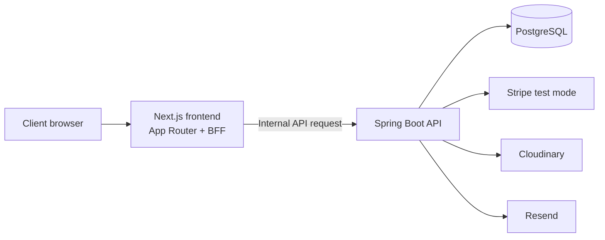

# Zevlance

> A full-stack freelance marketplace for connecting clients with independent professionals—from project discovery and proposals to contracts, milestones, payments, reviews, and dispute resolution.

[](https://nextjs.org/)
[](https://spring.io/projects/spring-boot)
[](https://openjdk.org/)
[](https://www.postgresql.org/)

## Highlights

- Role-based workflows for **clients**, **freelancers**, and **administrators**.
- Project publishing, discovery, proposals, bid management, and contracts.
- Milestone tracking, Stripe-powered test payments, refunds, and payment lifecycle safeguards.
- Reviews, notifications, profiles, image uploads, and public freelancer/project views.
- A dedicated dispute workflow and an administration workspace for users, projects, and audit activity.
- Secure authentication with JWT, server-side API proxying, protected internal API calls, and database migrations managed by Flyway.

## Architecture



The frontend's BFF layer forwards authenticated browser requests to the API. The API validates the shared internal secret, keeps service credentials server-side, and persists data in PostgreSQL.

## Tech stack

| Area | Technology |
| --- | --- |
| Frontend | Next.js 16, React 19, TypeScript, Tailwind CSS, shadcn/ui |
| State and forms | TanStack Query, Zustand, React Hook Form, Zod |
| Backend | Java 21, Spring Boot 4, Spring Security, Spring Data JPA |
| Database | PostgreSQL, Flyway, Hibernate |
| Integrations | Stripe, Cloudinary, Resend |
| Testing | JUnit, Spring Boot Test, Testcontainers |

## Repository layout

```text
.
├── frontend/             # Next.js application and BFF proxy
│   ├── app/              # Routes and page composition
│   ├── modules/          # Feature-oriented UI and client logic
│   └── .env.example      # Frontend environment-variable template
├── backend/              # Spring Boot REST API
│   ├── src/main/java/    # Domain modules, security, services, controllers
│   ├── src/main/resources/db/migration/
│   └── .env.example      # Backend environment-variable template
└── DEPLOYMENT.md         # Historical deployment notes
```

## Run locally

### Prerequisites

- Java 21
- Node.js 22 and pnpm
- PostgreSQL
- Stripe, Cloudinary, and Resend credentials for their respective features

### 1. Configure the backend

```bash
cd backend
cp .env.example .env
```

Set the database and secret values in `backend/.env`. At minimum, configure `DATABASE_URL`, `DATABASE_USERNAME`, `DATABASE_PASSWORD`, `JWT_SECRET`, and `INTERNAL_API_SECRET`.

For local PostgreSQL, the default JDBC URL is:

```text
jdbc:postgresql://localhost:5432/freelancehub
```

Start the API:

```bash
./mvnw spring-boot:run
```

The API runs at `http://localhost:8080`. Flyway applies the database migrations automatically.

### 2. Configure and start the frontend

In a second terminal:

```bash
cd frontend
cp .env.example .env.local
pnpm install
pnpm dev
```

Set the matching values in `frontend/.env.local`:

```env
BACKEND_INTERNAL_URL=http://localhost:8080/api/v1
INTERNAL_API_SECRET=<same value used by the backend>
```

Open [http://localhost:3000](http://localhost:3000).

## Environment variables

Use the committed templates as the authoritative reference:

- [`backend/.env.example`](backend/.env.example)
- [`frontend/.env.example`](frontend/.env.example)

Never commit `.env`, `.env.local`, database URLs with credentials, API keys, JWT secrets, or webhook secrets. Keep `INTERNAL_API_SECRET` identical in the frontend and backend configurations.

## Quality checks

```bash
# Backend tests
cd backend && ./mvnw test

# Frontend checks
cd frontend && pnpm lint && pnpm build
```

## Security notes

- Authentication cookies are secured in the production profile.
- The public frontend does not receive backend, payment, email, or database credentials.
- Stripe must remain in **test mode** unless a complete production security and compliance review is performed.
- If a credential is ever committed, revoke it immediately and rewrite the affected Git history before publishing the repository.

## License

This repository is intended as a personal portfolio project. Add a license before accepting external contributions or re-use.
