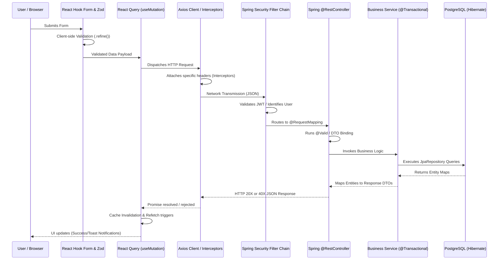

# FreelanceHub - Detailed Request-Response Cycle

This document isolates and breaks down the exact end-to-end lifecycle of a data mutation (e.g., submitting a bid, creating a project, funding a milestone) within the FreelanceHub architecture.

## Visual Flow Overview

---

## The Cycle: Step-by-Step Breakdown

### Phase 1: Client Interaction & Validation
1. **User Action:** The user clicks a submit button (e.g., "Submit Bid").
2. **React Hook Form (RHF) Interception:** The form intercepts the native HTML submit event. 
3. **Zod Validation:** RHF passes the input map to the `standardSchemaResolver()` backed by a Zod schema. Zod enforces type safety, constraints (e.g., `budget >= 50`), and runs `.refine()` paths for cross-variable checks.
4. If validation fails, RHF blocks network invocation and displays inline errors.

### Phase 2: React Query Request Preparation
1. **The Mutation:** The form's `onSubmit` logic wraps the valid payload and passes it into a React Query mutation (`mutateAsync()`).
2. **State Management:** The UI implicitly transitions to a loading state because `isPending` or `isSubmitting` becomes `true`.

### Phase 3: The Axios Dispatch
1. **Service Call:** The mutation invokes a predefined Axios promise from the `api/` hooks layer.
2. **Axios Interceptor Execution:**
   - **Request Interceptor:** Automatically configures `withCredentials: true` to ensure the Secure HttpOnly session cookie (holding the JWT) and standard CSRF tokens are injected seamlessly.
   - **Network Over-the-Wire:** The payload is serialized to JSON and broadcast to the Next.js `proxy.ts` (if routed via frontend) or directly to the Spring Boot Gateway `http://localhost:8080/api/v1`.

### Phase 4: Spring Boot Ingress & Security Gates
1. **DispatcherServlet:** Receives the incoming REST request.
2. **Spring Security Filter Chain:** Provides the initial defensive wall.
   - **CORS Filter:** Checks incoming `Origin: http://localhost:3000` against allowed origins.
   - **JWT Authentication Filter:** An extension of `OncePerRequestFilter`. It reads the `Cookie` header, splits it to find the JWT, verifies its signature using `io.jsonwebtoken` parameters, checks expiration, and evaluates if the user exists.
3. **Security Context Population:** The filter mints a `UsernamePasswordAuthenticationToken` appending roles (`ROLE_CLIENT` or `ROLE_FREELANCER`) and commits it to the Spring Security Context.

### Phase 5: Controller & Transport Layer
1. **Routing:** Spring finds the specific `@PostMapping` matching the URL path.
2. **Authorization Enforcement:** Methods flagged with `@PreAuthorize("hasRole('CLIENT')")` evaluate the Security Context. A mismatch forces a hard `403 Forbidden`.
3. **Deserialization & `@Valid`:** Jackson converts the raw JSON string into a structured Java Request Data Transfer Object (DTO). Spring executes standard Java Validation (`@NotBlank`, `@Min`) bounds on the DTO properties.

### Phase 6: Service Layer & Business Logic
1. **Service Invocation:** The Controller passes the valid DTO to the backend Service class.
2. **Transactional Setup:** Methods annotated with `@Transactional` instruct Hibernate to open a Postgres session boundary.
3. **Entity Operations:** The Service performs structural business rules (e.g., Can a Freelancer bid on a closed project? Are funds sufficient?).
4. **Data Access Layer (JPA):** 
   - Entities (`Freelancer`, `Bid`, `Project`) are modified.
   - `bidRepository.save(newBid)` is invoked.
5. **Database Execution:** Hibernate calculates the structural dirty-diff and maps the objects down into prepared PostgreSQL `INSERT`/`UPDATE` transactions, verifying foreign-keys in the database schema.
6. **Commit:** Ensure no exceptions occurred. Commits the SQL transaction bounds.

### Phase 7: Response Mapping & Traversal back to Client
1. **Response Preparation:** The backend maps the raw saved Entity into a sanitized Response DTO (shedding sensitive arrays/password fields) and wraps it inside a `ResponseEntity(HttpStatus.CREATED)`.
2. **JSON Serialization:** The object transmits back across the network boundaries to the client's browser.
3. **Response Interception:** The global Axios response interceptor processes the status code.
   - If `401 Unauthorized`, it may instruct the `auth-store` Zustand manager to forcefully `logout()` and dump the session.
   - If `400 Bad Request`, error mapping transforms the Java JSON exception cleanly.

### Phase 8: State Invalidation & UI Rendering
1. **Mutation Outcome:** The `mutateAsync` Promise resolves successfully in React Query.
2. **Cache Purge:** The `onSuccess()` block of the hook selectively targets standard keys (e.g., `queryClient.invalidateQueries(resourceKeys.lists())`).
3. **Auto-Refetch:** React Query automatically silently fires a `GET` request in the background to seamlessly reconstruct the new underlying list.
4. **UI Response:** `toast.success("Action Completed")` renders via Sonner, and the view updates to include the brand new data reflecting the entire roundtrip lifecycle sync.
